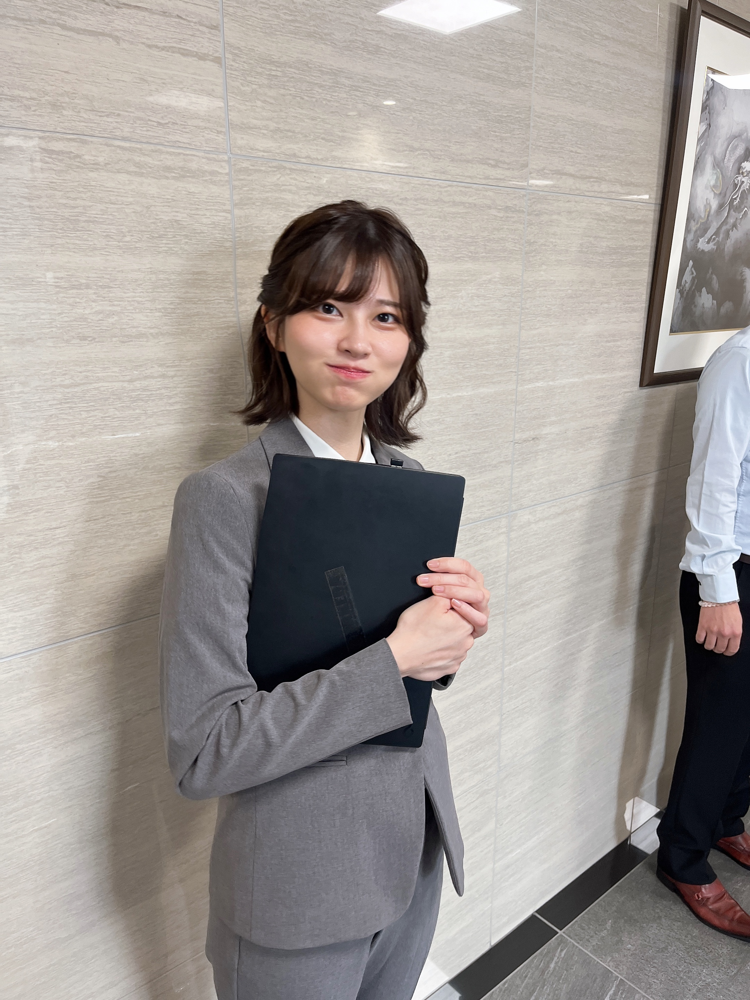
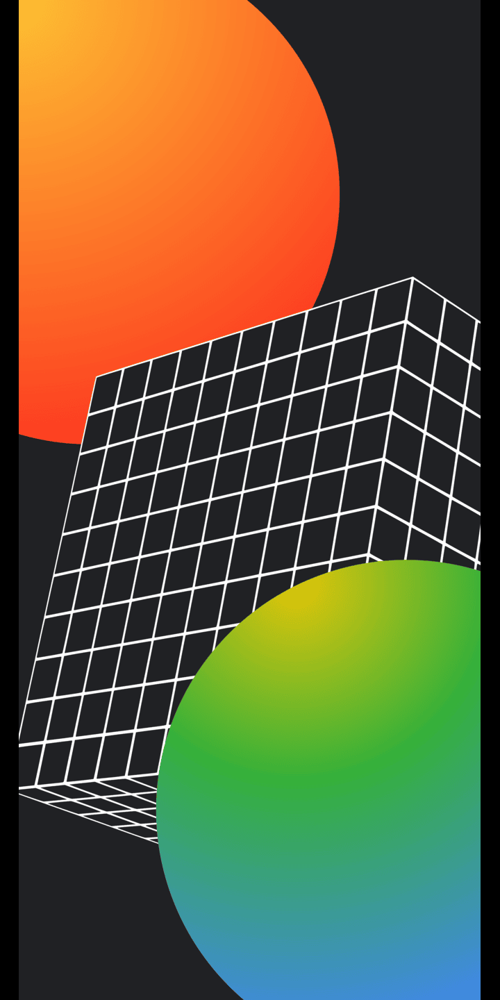

# Py-Artist
This is my take on [pyar-tist](https://github.com/Kishlay-notabot/pyar-tist/). I just used a different approach of rearranging already placed text based on brightness of the adjacent pixels(effective area), intead of thresholding and randomly placing text blocks

## How to Use
#### Install Dependencies
```sh
pip install -r requirements.txt
```

#### Run the program
```sh
python main.py {input_image} {effective_area} {strength_multiplier} {text}
```
- input_image: is pretty self explanatory
- effective_area: this is the area that is used to calculate displacement of text at that pixel
- strength_multiplier: it is multiplied to the displacement value, increase it to get a more dramatic effect
- text: this is what is put onto the canvas for the pixel, if length of text is greater than 1, it is looped through repeatedly


## Results
Input Image | Output Image
---- | ---
 | 
 | 
